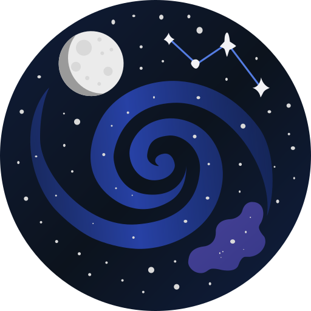

<br/><br/>

# Astronomy images repository
The most advanced open source catalog of DSO objects images and astronomy images. An initiative of the Celestialy project.


---

A curated collection of astronomical images organized by object type and resolution. Intended for use in educational, outreach, visualization, and research projects.

---

## 🌌 Table of contents

* [Astronomy images repository](#-astronomy-images-repository)

  * [🌌 Table of contents](#-table-of-contents)
  * [📂 Folder Structure Overview](#-folder-structure-overview)
  * [🧭 Image Categories](#-image-categories)
  * [📄 JSON Metadata Structure (`*_images.json`)](#-json-metadata-structure-_imagesjson)

    * [JSON Structure Overview](#json-structure-overview)
    * [`images[]` Entry Fields](#images-entry-fields)
    * [Example](#example)
  * [🌐 How to Request an Asset (via jsDelivr CDN)](#-how-to-request-an-asset-via-jsdelivr-cdn)

    * [🔗 Base URL Format](#-base-url-format)
    * [🧪 Examples](#-examples)

      * [🌀 Deep Sky Object (e.g. NGC 1976, 1280x900)](#-deep-sky-object-eg-ngc-1976-1280x900)
      * [🌙 Moon Phase image](#-moon-phase-image)
      * [🌌 Constellation Chart (e.g. Orion)](#-constellation-chart-eg-orion)
      * [🔧 Fallback (e.g. if an image is missing)](#-fallback-eg-if-an-image-is-missing)
  * [🏷️ Usage Guidelines](#️-usage-guidelines)
  * [📚 Credits & Sources](#-credits--sources)
  * [⚖️ License](#️-license)

---

## 📂 Folder Structure Overview

```
images/
├── constellations/
│   ├── jpg/   → <IAU_code>.jpg  
│   └── pdf/   → <IAU_code>.pdf  
├── dso/                     # Deep Sky Objects
│   ├── ic/                  # Index Catalogue
│   │   └── <resolution>/
│   ├── messier/             # Messier Catalogue
│   │   └── <resolution>/
│   └── ngc/                 # New General Catalogue
│       └── <resolution>/
├── moon/                    # Lunar images and visualizations
├── not_available/           # Fallback placeholder images
│   ├── fallback_1280x900.jpg
│   ├── fallback_1920x1280.jpg
│   ├── fallback_500x300.jpg
│   └── fallback_900x900_inverted.jpg
```

---

## 🧭 Image Categories

* **Constellations**
  JPEG and PDF sky charts named using their official IAU codes.

* **DSO (Deep Sky Objects)**
  Images from the IC, Messier, and NGC catalogs, each available in three resolutions: `500x300`, `1280x900`, and `1920x1280`.
  Each object includes a `*_images.json` file with images metadata, and available files for the selected object.

* **Moon**
  High-resolution lunar images and NASA moon phase images in order.

* **Not Available**
  Fallback images used when an asset is missing.

---

## 📄 JSON Metadata Structure (`*_images.json`)

Each Deep Sky Object image folder includes a metadata file named like `ngc_1976_images.json`. This file describes the object and its associated image(s).

### JSON Structure Overview

| Field    | Type     | Description                                 |
| -------- | -------- | ------------------------------------------- |
| `name`   | `string` | Full object name (e.g., `"NGC1976"`)        |
| `id`     | `number` | Object catalog number (e.g., `1976`)        |
| `images` | `array`  | List of image entries (see subfields below) |

### `images[]` Entry Fields

| Field         | Type      | Description                                                                  |
| ------------- | --------- | ---------------------------------------------------------------------------- |
| `filename`    | `string`  | File name of the image (e.g., `"ngc_1976_default.jpg"`)                      |
| `description` | `string`  | Short image description or caption                                           |
| `origin_url`  | `string`  | Source or reference URL for the image                                        |
| `is_default`  | `boolean` | Indicates if this image is the default/primary for the object (`true/false`) |

### Example

```json
{
  "name": "NGC1976",
  "id": 1976,
  "images": [
    {
      "filename": "ngc_1976_default.jpg",
      "description": "HST image of NGC 1976, also known as M42, the Orion Nebula",
      "origin_url": "https://cseligman.com/text/atlas/ngc19a.htm#1976",
      "is_default": true
    }
  ]
}
```

---

## 🌐 How to Request an Asset (via [jsDelivr CDN](https://www.jsdelivr.com/))

You can load any asset directly from this repository using jsDelivr's CDN. Replace `<path>` with the relative file path from the `images/` folder.

### 🔗 Base URL Format

```
https://cdn.jsdelivr.net/gh/CelestialyXYZ/Astronomy-images@master/images/<path>
```

### 🧪 Examples

#### 🌀 Deep Sky Object (e.g. NGC 1976, 1280x900)

**Image:**

```
https://cdn.jsdelivr.net/gh/CelestialyXYZ/Astronomy-images@master/images/dso/ngc/1280x900/ngc_1976_default.jpg
```

**Metadata JSON:**

```
https://cdn.jsdelivr.net/gh/CelestialyXYZ/Astronomy-images@master/images/dso/ngc/1280x900/ngc_1976_images.json
```

#### 🌙 Moon Phase image

```
https://cdn.jsdelivr.net/gh/CelestialyXYZ/Astronomy-images@master/images/moon/moon_100.jpg
```

#### 🌌 Constellation Chart (e.g. Orion)

**JPG:**

```
https://cdn.jsdelivr.net/gh/CelestialyXYZ/Astronomy-images@master/images/constellations/jpg/Ori.jpg
```

**PDF:**

```
https://cdn.jsdelivr.net/gh/CelestialyXYZ/Astronomy-images@master/images/constellations/pdf/Ori.pdf
```

#### 🔧 Fallback (e.g. if an image is missing)

```
https://cdn.jsdelivr.net/gh/CelestialyXYZ/Astronomy-images@master/images/not_available/fallback_1280x900.jpg
```

---

## 🏷️ Usage Guidelines

These assets may be used for:

* Astronomy education and classroom materials
* Visual aids in public talks or planetarium shows
* Astronomy-related software and applications
* Celestialy's own digital products

---

## 📚 Credits & Sources

* **Courtney Seligman**
  [NGC & DSO data](https://cseligman.com/text/atlas.htm)

* **NASA Scientific Visualization Studio**
  [Moon phase animations](https://svs.gsfc.nasa.gov/4310)

* **Wikipedia**
  [Messier catalog](https://en.wikipedia.org/wiki/Messier_object)

* **IAU / ESO Archive**
  [Constellation charts](https://iauarchive.eso.org/public/themes/constellations/)

* **CelestialyXYZ / Astronomy-images Repo**
  Image hosting & structure: [https://github.com/CelestialyXYZ/Astronomy-images](https://github.com/CelestialyXYZ/Astronomy-images)

---

## ⚖️ License

**Creative Commons Attribution-NonCommercial 4.0 International (CC BY-NC 4.0)**
You are free to:

* **Share** — copy and redistribute the material
* **Adapt** — remix and build upon the material

**Under the following terms:**

* **Attribution** — You must credit the original sources listed above and **this repository**.
* **NonCommercial** — No commercial use permitted.

🔗 [Read the full license](https://creativecommons.org/licenses/by-nc/4.0/)
